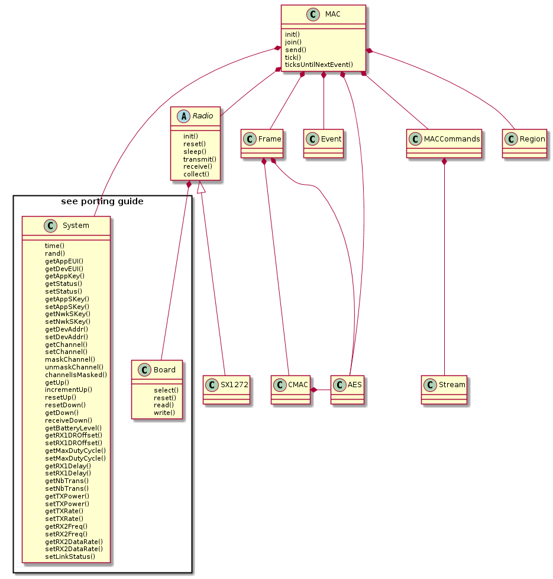
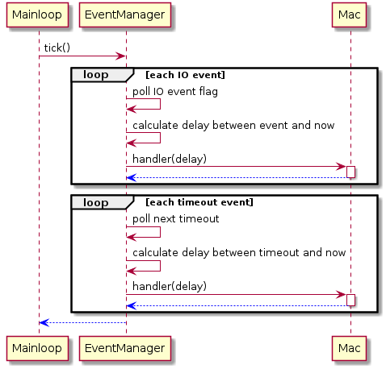
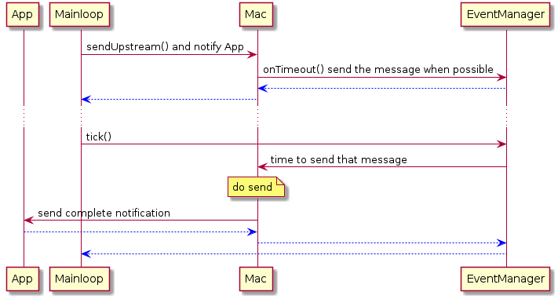
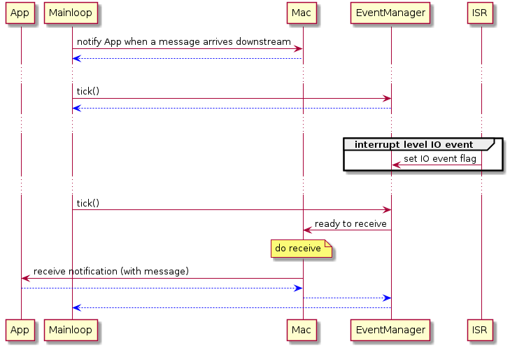
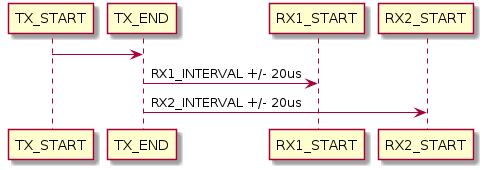

LoraDeviceLib
=============

A LoRaWAN device implementation still in an early stage of development.

## Highlights

- Support for class A
- Event driven style
- Modular implementation
    - Chanel List
    - MAC
    - MAC Commands
    - Event Manager
    - Region Database
        - EU_863_870
    - Radio
        - SX1272
    - Frame Codec
    - AES and CMAC implementation
- Build-time Porting features
    - Replace AES and CMAC implementations
    - Replace logging and assert functions
- Tests utilising the Cmocka framework
- Ruby binding for accelerated integration testing and simulation

## High Level Architecture

LDL breaks the problem into standalone modules which can be mocked out during testing:

LDL is intended to be driven from two tasks - an _iterrupt_ level task and a _mainloop_ level task.

The _interrupt_ level task signals when IO events occur. It runs for a short time and never blocks. The _interrupt_ level task must *never*
be interrupted by the _mainloop_ level task. 

The _mainloop_ level task drives all other functionility from a single thread of execution. 
There are a small number of critical sections between the _interrupt_ level and _mainloop_ level threads - the _mainloop_ level task
will always use atomic operations when accessing these sections.

All _mainloop_ code runs from calls to EventManager.tick():

Below is a simplified sequence of sending data:

Below is a simplified sequence of recieving data:

### Timing Requirements

LoRaWAN requires that receive windows open at a precise interval measured
from the end of the TX. This can be challenging to implement on a busy system
that doesn't use an RTOS since other tasks in the mainloop will add
jitter to when LDL can open the RX window.

The diagram below illustrates the TX -> RX1 -> RX2 pattern:

The architecture handles RX windows as follows:

- The end of TX is detected by an IO event sent from the transeiver to the EventManager via an interrupt
    - The EventManager keeps a microsecond timestamp of when this IO event is received
- The IO event is handled by EventManager.tick() at any time after TX and before the RX window
    - This is a one or more second window
- The IO event handler schedules a timer callback to run at the RX window time
    - The interval is calculated as `interval = RX_INTERVAL - (time_now - tx_end_time) - spi_delay - typical_jitter`
    - `spi_delay` is time added to account for communication between LDL and the radio transciever (i.e. over SPI)
    - `typical_jitter` is time added to account for jitter in handling the timeout event
- The timeout event handler runs after the aforementioned interval
    - The handler calculates the current time relative to the RX window
        - if late, LDL abandons the RX window        
        - if early, LDL blocks until the start of the RX window
- This pattern is the same for RX1 and RX2 windows
    
In summary:

- In LDL, IO events are lower priority than timeout events, and timeout events work best when jitter is low
- RX1 and RX2 windows are met on best effort
    - Timeout events can be set to trigger early to account for worst case jitter
    - LDL will skip an RX window if the timestamps show that the timeout has been handled too late
- The effect of jitter on LDL is that:
    - Clock cycles may be wasted blocking
    - RX windows may be missed
    
## Porting Guide

### Mandatory

#### Implementent System_getDevEUI()

~~~
void System_getDevEUI(void *owner, uint8_t *eui);
~~~

The MAC uses this interface to get the DevEUI. 

#### Implementent System_getAppEUI()

~~~
void System_getAppEUI(void *owner, uint8_t *eui);
~~~

The MAC uses this interface to get the AppEUI. 

#### Implementent System_getAppKey()

~~~
void System_getAppKey(void *owner, uint8_t *key)
~~~

The MAC uses this interface to get the AppKey. 

#### Implement System_getTime()

~~~
uint64_t System_getTime(void);
~~~

This function must return system time (e.g. time since power up) in microseconds.

#### Implement System_usleep()

~~~
void System_usleep(uint32_t interval);
~~~

This function must cause the program counter to block for an interval of microseconds.

#### Implement System_atomic_setPtr()

~~~
void System_atomic_setPtr(void **receiver, void *value);
~~~

This function must atomically write value to the receiver memory location.

### Optional

### Define a Platform Specific Error Message Stream

Define `LORA_ERROR(...)` to be a function that takes a printf style variadic argument.

LoraDeviceLib will print messages to explain why certain functions fail. The
default configuration is to remove these messages from the build.

### Define a Platform Specific Assert Handler

Define `LORA_ASSERT(X)` to be an assertion that takes X as an argument.

LoraDeviceLib makes run time assertions to catch bugs. It is recommended
that this macro is defined at least for debug builds.

### Substitute an Alternative AES Implementation

1. Define `LORA_USE_PLATFORM_AES`
2. Define `struct lora_aes_ctx` to suit the platform implementation
3. Implement `LoraAES_init` and `LoraAES_encrypt` to wrap platform implementation

### Substitute an Alternative CMAC Implementation

1. Define `LORA_USE_PLATFORM_CMAC`
2. Define `struct lora_cmac_ctx` to suit the platform implementation
3. Implement `LoraCMAC_init`, `LoraCMAC_update`, and `LoraCMAC_finish` to wrap platform implementation

### Customise lora_radio_sx1272

- define LORA_RADIO_SX1272_USE_BOOST

    - Define this symbol if your hardware makes use of the BOOST pin
    - If not defined, radio will use the RFO pin

## License

LoraDeviceLib has an MIT license.
